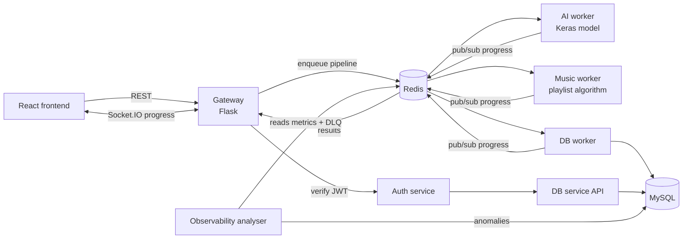

# Sentiment Playlist Generator

Type how you feel, pick how you want to feel, and get a playlist that moves you from one to the other.

A text emotion classifier places your current mood on a 2D **valence–arousal** plane. A path-finding algorithm then walks across a 1,000-song map from that point towards your target emotion, so the playlist shifts mood gradually instead of jumping straight there.

The system is deliberately over-engineered: a small product built as a set of microservices so I could learn system design, asynchronous processing and observability on something with a real user.

## Tech stack

| Layer | Technologies |
|---|---|
| Frontend | React 19, Vite, Tailwind CSS, daisyUI, Socket.IO client |
| Backend services | Python, Flask, Flask-SocketIO, Flask-JWT-Extended, SQLAlchemy |
| Async processing | Celery, Redis (broker, cache, pub/sub, dead-letter queue, metrics) |
| ML | TensorFlow / Keras, scikit-learn (CountVectorizer), NLTK, neattext |
| Data | MySQL 8 |
| Infrastructure | Docker, Docker Compose |

## Architecture



| Service | Responsibility |
|---|---|
| `gateway` | Single entry point. Serves the React build, verifies requests with the auth service, starts the Celery pipeline and streams progress back to the browser over Socket.IO. |
| `auth_service` | Sign-up, login and JWT verification (tokens held in cookies). The single source of truth for authentication. |
| `ai_service` | Celery worker that runs the emotion classifier (`--pool=solo`, because TensorFlow breaks under forked workers). |
| `music_service` | Celery worker that generates the playlist from the predicted and target emotions. |
| `db_service` | The only service that touches MySQL: an internal API for user queries plus a Celery worker that saves playlists. Failed saves retry, then go to the dead-letter queue. |
| `aiops` | Observability analyser that runs every 5 minutes and applies rule-based anomaly detection to metrics and DLQ entries. |

### Request flow

1. The frontend sends the text and target emotion to the gateway, which verifies the user's JWT with the auth service.
2. The gateway starts a Celery **chain**: AI prediction → playlist generation → database save. It returns immediately, so it never blocks on model inference.
3. Each worker publishes progress to a Redis pub/sub channel. A listener thread in the gateway forwards those updates to the browser over Socket.IO, which costs less than having clients poll.
4. The finished playlist is cached in Redis. Common mood transitions (e.g. sad → happy) repeat often, and caching skips the two slowest steps: prediction and playlist generation.

## How it works

**Emotion classifier.** The text is cleaned (neattext), tokenised and stemmed (NLTK), then vectorised with a bag-of-words `CountVectorizer`. A Keras feed-forward network (Dense 256 → 128 → 64, dropout 0.25) then outputs probabilities over 13 emotions. Training code: `ai_service/development/ai3.py`.

**Starting point.** Each emotion has a fixed coordinate on the valence–arousal plane. The user's starting point is the probability-weighted average of those coordinates, so mixed feelings land between emotions rather than snapping to one.

**Playlist path.** Songs are placed on the same plane. The algorithm moves from the starting point towards the target, choosing the nearest songs by Euclidean distance at each step and handling transitions between quadrants. This gives a gradual change in mood.

## Observability

Every service emits three kinds of signal:

- **Structured JSON logs** with a request ID that follows each request across services.
- **Metrics** (success and error counts, retries, latency) aggregated per minute in Redis. Latency is stored in sorted sets so p95 and p99 can be computed.
- **A dead-letter queue** of failed tasks. Repeated failures are fingerprinted so they increment one counter instead of piling up as duplicates.

The `aiops` analyser checks those signals against rules: error rate, excessive retries, recurring DLQ failures, and p95/p99 latency spikes. It deduplicates the anomalies it finds and stores them in MySQL. Hot metrics expire from Redis after an hour and failed payloads after 24 hours.

## Running locally

Requires Docker and Docker Compose.

```bash
git clone https://github.com/jjhhsss22/sentiment-playlist-generator-extension.git
cd sentiment-playlist-generator-extension
docker compose up --build
```

Then open <http://localhost:5000>.

## Design decisions and trade-offs

- **Why microservices for a small app?** To learn the system, not because the load needs it. Each service has one job:
  - **gateway:** the single source of truth for every other service.
  - **ai:** can be scaled or retrained independently.
  - **music:** songs are currently objects in a `Songs` class, so the catalogue can be swapped out without touching anything else.
  - **db:** keeps user-facing servers away from the database.
  - **auth:** the single source of truth for authentication.

  The AI and music services are also the most likely to fail, so isolating them contains errors.
- **Why Celery instead of synchronous calls?** The gateway stays responsive and free for other connections while the model runs, which significantly reduced request response time.
- **Why WebSockets instead of polling?** With polling, every waiting client hits the gateway repeatedly, which slows it down when many requests are in flight. A single Redis pub/sub listener pushing over Socket.IO is far cheaper.
- **Why caching?** A few mood transitions dominate real usage (sad → happiness, boredom → enthusiasm), and metrics showed prediction and playlist generation were the main latency bottlenecks, so both results are cached.
- **Why logs, metrics and a DLQ together?** Each answers a different question:
  - **Logs** are for short-term forensics and debugging, in a format ready for services like CloudWatch.
  - **Metrics** count what matters, such as request duration.
  - **The DLQ** records exactly what failed and why, as raw input for future MLOps work.
- **Per-service observability modules** are duplicated instead of shared. With only a few services, that was simpler than building a shared library. With more services, I'd move to a shared package or middleware.
- **Not yet done:** automated tests, secrets management (credentials are currently dev defaults in the compose file), and production deployment.

## Background

This extends my original sentiment playlist generator, which was built for a real user and shaped through user interviews. [Original project documentation](https://docs.google.com/document/d/1xRGxF-19MLz0YQcSxIe7rRYlSt83DojQSZsl5oeYK54/edit?usp=sharing).